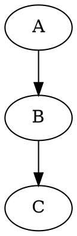

### Data Structures & Algorithms 

- Search the kth element node.
- Set its parent G's right child to none and go to the parent of G and subtract the weight of k from it.
- Go for successive nodes an

